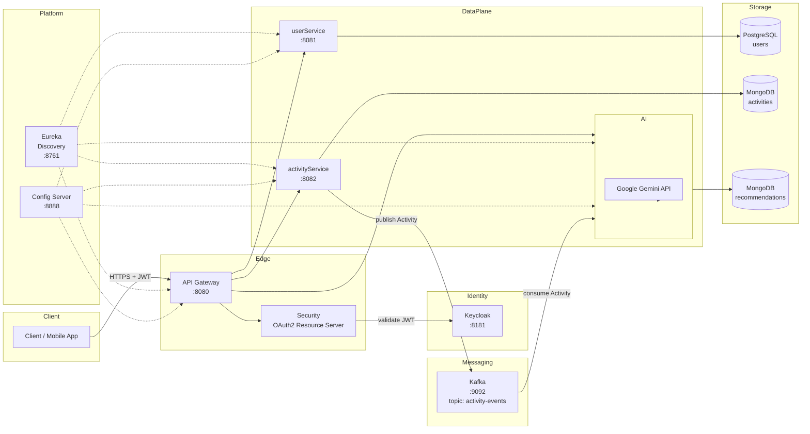
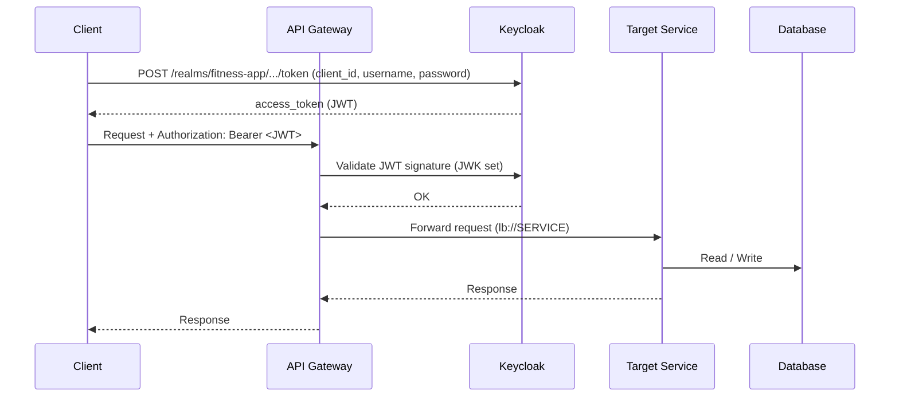
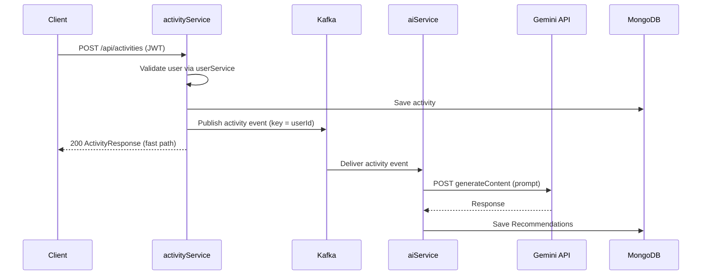

# AI-Powered Fitness Microservices Platform

[](https://adoptium.net)
[](https://spring.io/projects/spring-boot)
[](https://spring.io/projects/spring-cloud)

A production-oriented, event-driven microservices platform for fitness activity tracking and AI-generated workout recommendations. Activity events are processed asynchronously through Apache Kafka, and AI recommendations are generated via the Google Gemini API, decoupled from the request path.

---

## Table of Contents

- [Project Overview](#project-overview)
- [System Architecture](#system-architecture)
  - [Runtime Topology](#runtime-topology)
  - [Request Flow](#request-flow)
  - [Event-Driven Flow](#event-driven-flow)
- [Technology Stack](#technology-stack)
- [Repository Structure](#repository-structure)
- [Services](#services)
- [Getting Started](#getting-started)
  - [Prerequisites](#prerequisites)
  - [1. Start Infrastructure](#1-start-infrastructure)
  - [2. Configure Environment Variables](#2-configure-environment-variables)
  - [3. Build](#3-build)
  - [4. Run Services](#4-run-services)
  - [5. Obtain a JWT Token](#5-obtain-a-jwt-token)
  - [6. Verify the Pipeline](#6-verify-the-pipeline)
- [Configuration](#configuration)
- [API Reference](#api-reference)
  - [userService](#userservice)
  - [activityService](#activityservice)
  - [aiService](#aiservice)
- [Security](#security)
- [Troubleshooting](#troubleshooting)
- [Known Limitations](#known-limitations)
- [Roadmap](#roadmap)
- [Author](#author)

---

## Project Overview

The platform separates concerns across four application microservices and three infrastructure services:

| Concern | Service |
| --- | --- |
| Identity & user data | userService (PostgreSQL) |
| Activity tracking | activityService (MongoDB, Kafka producer) |
| AI recommendations | aiService (MongoDB, Kafka consumer, Gemini API) |
| API entry point | gateway (Spring Cloud Gateway) |
| Discovery, configuration, IAM | eureka, configServer, keycloak |

Heavy AI processing is fully decoupled from the request flow. When a user tracks an activity, the activity service persists it and publishes an event to Kafka. The AI service consumes that event asynchronously, calls the Gemini API, and persists a structured recommendation. Clients receive a fast, synchronous response while recommendation generation happens in the background.

---

## System Architecture

### Runtime Topology



### Request Flow



### Event-Driven Flow



---

## Technology Stack

### Backend & Frameworks

- Java 21
- Spring Boot 4.x
- Spring Cloud 2025.1.x (Gateway, Config Server, Netflix Eureka)
- Spring Security + OAuth2 Resource Server

### Data & Messaging

- Apache Kafka 7.5 (Confluent) with Zookeeper
- PostgreSQL 16 (userService)
- MongoDB 7 (activityService, aiService)
- Spring Data JPA / Hibernate
- Spring Data MongoDB

### AI

- Google Gemini API (REST via WebClient)

### Identity

- Keycloak 24

### Tooling

- Docker / Docker Compose
- Maven
- Lombok

---

## Repository Structure

```
fitness-microservice/
├── eureka/                  # Service discovery server (8761)
├── configServer/            # Centralized configuration (8888)
│   └── src/main/resources/config/
│       ├── user-service.yaml
│       ├── activity-service.yaml
│       ├── ai-service.yaml
│       └── gateway-service.yaml
├── gateway/                 # API gateway / OAuth2 resource server (8080)
├── userService/             # User management (8081)
├── activityService/         # Activity tracking + Kafka producer (8082)
├── aiService/               # Gemini recommendations + Kafka consumer (8083)
├── keycloak/
│   └── realm.json           # Realm import: fitness-app
├── docker-compose.yml       # Infrastructure: Keycloak, Kafka, Zookeeper, PostgreSQL, MongoDB
└── .env                     # Local Gemini credentials (not committed)
```

---

## Services

| Service | Port | Description | Storage / Integration |
| --- | --- | --- | --- |
| gateway | 8080 | API entry point; JWT validation and routing | Keycloak, Eureka |
| userService | 8081 | User registration, profiles, validation | PostgreSQL |
| activityService | 8082 | Activity tracking; publishes activity events | MongoDB, Kafka (producer) |
| aiService | 8083 | Consumes activity events, generates recommendations | MongoDB, Kafka (consumer), Gemini API |
| eureka | 8761 | Service discovery | - |
| configServer | 8888 | Centralized configuration (native profile) | - |
| keycloak | 8181 | Identity provider, realm `fitness-app` | - |

---

## Getting Started

### Prerequisites

- Java 21
- Maven 3.8+
- Docker
- Docker Compose
- A Gemini API key (https://aistudio.google.com)

### 1. Start Infrastructure

```bash
docker-compose up -d
```

This starts Keycloak, Kafka, Zookeeper, PostgreSQL, and MongoDB. Verify health:

```bash
docker ps
```

**Important:** the compose file mounts `./keycloak/realm-import.json`, but the realm file is `keycloak/realm.json`. Before starting, either rename the file or update the volume mapping so the `fitness-app` realm is imported:

```yaml
# docker-compose.yml
volumes:
  - ./keycloak/realm.json:/opt/keycloak/data/import/realm.json:ro
```

### 2. Configure Environment Variables

The AI service requires the Gemini API credentials. Create a `.env` file in the project root:

```bash
GEMINI_KEY=YOUR_GEMINI_API_KEY
GEMINI_URL=https://generativelanguage.googleapis.com/v1beta/models/gemini-flash-latest:generateContent
```

Load them into the environment before running the AI service:

```powershell
# PowerShell
$env:GEMINI_KEY = (Get-Content .env | Where-Object { $_ -match '^GEMINI_KEY=' }).Split('=')[1]
$env:GEMINI_URL = (Get-Content .env | Where-Object { $_ -match '^GEMINI_URL=' }).Split('=')[1]
```

```bash
# bash
export $(grep -v '^#' .env | xargs)
```

### 3. Build

aiService declares a compile-time dependency on the `activityService` artifact, so install it first:

```bash
cd activityService
mvn clean install

cd ../aiService
mvn clean install
```

Build the remaining services:

```bash
cd ../userService && mvn clean install
cd ../gateway && mvn clean install
cd ../configServer && mvn clean install
cd ../eureka && mvn clean install
```

### 4. Run Services

Start services in order (each in its own terminal). The gateway must start last, once the downstream services are registered with Eureka.

| Order | Service | Command |
| --- | --- | --- |
| 1 | eureka | `cd eureka && mvn spring-boot:run` |
| 2 | configServer | `cd configServer && mvn spring-boot:run` |
| 3 | userService | `cd userService && mvn spring-boot:run` |
| 4 | activityService | `cd activityService && mvn spring-boot:run` |
| 5 | aiService | `cd aiService && mvn spring-boot:run` |
| 6 | gateway | `cd gateway && mvn spring-boot:run` |

Verify discovery: open `http://localhost:8761` and confirm all four services are registered.

### 5. Obtain a JWT Token

```bash
curl -X POST http://localhost:8181/realms/fitness-app/protocol/openid-connect/token \
  -H "Content-Type: application/x-www-form-urlencoded" \
  -d "client_id=fitness-app-client" \
  -d "username=fitness" \
  -d "password=fitness123" \
  -d "grant_type=password"
```

Pre-seeded Keycloak users (from `keycloak/realm.json`):

| Username | Password | Roles |
| --- | --- | --- |
| fitness | fitness123 | user |
| admin | admin123 | admin |

Use the returned `access_token` as a `Bearer` token for all API calls through the gateway.

### 6. Verify the Pipeline

```powershell
$TOKEN = "<access_token>"
$H = @{ Authorization = "Bearer $TOKEN" }

# 1. Register a user (or use the admin console to read an existing user id)
Invoke-RestMethod -Method Post -Uri http://localhost:8080/api/users/register -Headers $H -ContentType "application/json" -Body '{"email":"user@example.com","password":"secret123","firstName":"John","lastName":"Doe"}'

# 2. Track an activity (userId = the id returned above)
$body = '{"userId":"<user-id>","type":"RUNNING","duration":30,"caloriesBurned":280,"startTime":"2026-08-20T07:00:00","additionalMetrics":{"distanceKm":5.2}}'
Invoke-RestMethod -Method Post -Uri http://localhost:8080/api/activities -Headers $H -ContentType "application/json" -Body $body

# 3. After a few seconds the AI service saves a recommendation
Invoke-RestMethod -Method Get -Uri http://localhost:8080/api/recommendations/activity/<activity-id> -Headers $H
```

---

## Configuration

All runtime configuration is centralized in `configServer/src/main/resources/config/`. Services load it from the Config Server at startup (`spring.config.import: optional:configserver:http://localhost:8888`).

| File | Key settings |
| --- | --- |
| `user-service.yaml` | Datasource (PostgreSQL), JPA, Eureka, port 8081 |
| `activity-service.yaml` | MongoDB URI/db, Kafka producer, topic `activity-events`, port 8082 |
| `ai-service.yaml` | MongoDB URI/db, Kafka consumer (group `activity-processor-group`, JSON deserializer), Gemini API, port 8083 |
| `gateway-service.yaml` | Eureka, Keycloak JWK set URI, route definitions, port 8080 |

Environment overrides:

| Variable | Used by | Description |
| --- | --- | --- |
| `GEMINI_KEY` | aiService | Gemini API key |
| `GEMINI_URL` | aiService | Gemini generateContent endpoint |

---

## API Reference

All endpoints are served through the gateway at `http://localhost:8080` and require a valid JWT (`Authorization: Bearer <token>`).

### userService

| Method | Endpoint | Description |
| --- | --- | --- |
| POST | `/api/users/register` | Register a new user |
| GET | `/api/users/getAllUsers` | List all users |
| GET | `/api/users/{userId}` | Get a user profile |
| GET | `/api/users/{userId}/validate` | Check whether a user exists |

`POST /api/users/register`

```json
{
  "email": "user@example.com",
  "password": "secret123",
  "firstName": "John",
  "lastName": "Doe"
}
```

### activityService

| Method | Endpoint | Description |
| --- | --- | --- |
| POST | `/api/activities` | Track an activity and publish a Kafka event |

`POST /api/activities`

```json
{
  "userId": "<user-id>",
  "type": "RUNNING",
  "duration": 30,
  "caloriesBurned": 280,
  "startTime": "2026-08-20T07:00:00",
  "additionalMetrics": {
    "distanceKm": 5.2,
    "avgHeartRate": 148
  }
}
```

`type` is an enum (`ActivityType`) - for example `RUNNING`, `CYCLING`, `SWIMMING`, `WALKING`, `GYM`.

### aiService

| Method | Endpoint | Description |
| --- | --- | --- |
| GET | `/api/recommendations/user/{userId}` | Get all recommendations for a user |
| GET | `/api/recommendations/activity/{activityId}` | Get the recommendation for an activity |

A recommendation contains the analysis text plus lists of improvements, suggestions, and safety guidelines.

---

## Security

- The gateway is an OAuth2 resource server; every request is validated against the Keycloak realm `fitness-app` JWK set.
- Authentication is stateless (JWT); no server-side sessions.
- Roles (`user`, `admin`) are defined in the Keycloak realm for RBAC.
- The gateway currently requires authentication for all routes; no route is public.

### Security Checklist for Production

- Enforce RBAC per route in the gateway (`hasAuthority("ROLE_admin")`, etc.).
- Hash user passwords with a `PasswordEncoder` (BCrypt) in userService.
- Never return password fields in API responses.
- Move Gemini credentials to a secrets manager (e.g. env at the platform level).
- Serve Keycloak and all services over HTTPS/TLS.
- Add the missing `.gitignore` to prevent committing `.env`, `target/`, and IDE files.

---

## Troubleshooting

| Symptom | Likely cause | Fix |
| --- | --- | --- |
| Keycloak logs no realm import | Compose mounts `realm-import.json` but the file is `realm.json` | Update the volume mapping (see [Start Infrastructure](#1-start-infrastructure)) |
| 401 from gateway | Missing/expired/invalid JWT | Obtain a fresh token (see [Obtain a JWT Token](#5-obtain-a-jwt-token)) |
| 503 / no route for `/api/recommendations/**` | aiService not registered in Eureka (config client missing in `aiService/pom.xml`) | Add `spring-cloud-starter-config` to `aiService/pom.xml`; confirm the service shows in Eureka |
| Gateway routes not matched | Routes nested under the wrong property in `gateway-service.yaml` | Move routes to `spring.cloud.gateway.server.webflux.routes` |
| aiService listener fails to deserialize | Default `StringDeserializer` used because config-server properties are not applied | Add the config client dependency so `ai-service.yaml` Kafka settings load |
| No recommendations saved | Gemini call failed | Check aiService logs; the service persists a fallback recommendation |

---

## Known Limitations

- `RecommendationRepo.findAllById(String)` queries on the `@Id` field rather than `userId`; the user recommendation lookup should use a `findByUserId` query.
- No global exception handler (`@RestControllerAdvice`); unhandled exceptions surface as generic 500s.
- AI output formatting depends on the Gemini response structure; parsing failures fall back to a default recommendation.
- The `Recommendations` model lacks a no-args constructor required for clean MongoDB deserialization.
- DB credentials and secrets are hardcoded in local config files; move them to environment/secret injection for production.

---

## Roadmap

- Add role-based authorization rules per route.
- Encrypt user passwords and remove password fields from DTO responses.
- Add global error handling and structured API error responses.
- Add integration tests with Testcontainers.
- Containerize the application services and add them to `docker-compose.yml`.
- Introduce retries/idempotency for the Kafka consumer.
- Add OpenAPI/Swagger documentation per service.

---

## Author

Dinesh Shivaji Bodhapalle - Java Full Stack Developer

- GitHub: https://github.com/so-called-dinesh
- LinkedIn: https://www.linkedin.com/in/dineshbodhapalle
- Email: bodhapalleds2022@gmail.com